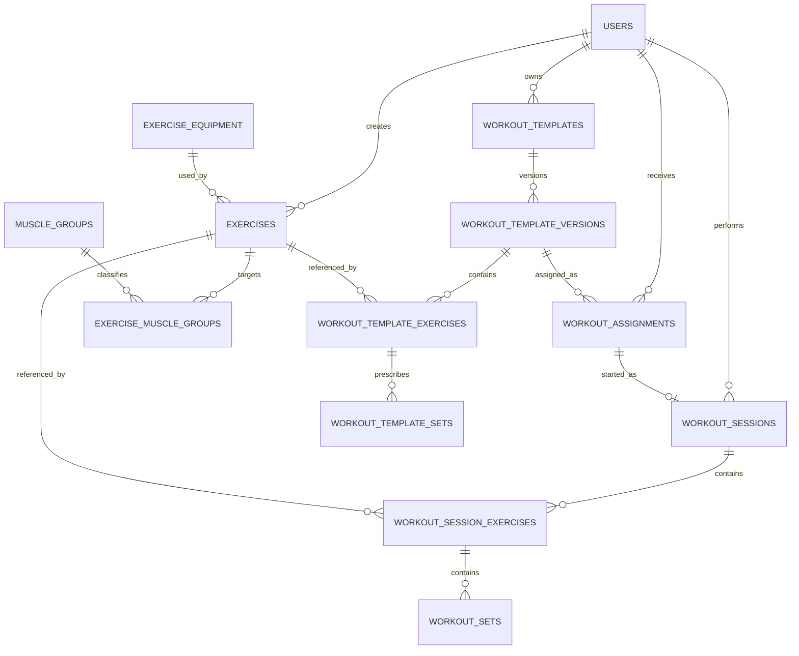

# Workout and Exercise Tracking Extension — Exact Implementation Specification

## Document Purpose

This document is the implementation contract for adding workout and exercise tracking to the existing mobile-first React/FastAPI/PostgreSQL fitness coaching application.

It consolidates the complete product, frontend, backend, database, API, authorization, scalability, accessibility, testing, and delivery requirements for the feature into one standalone specification. An implementation agent should treat this document as the source of truth for this feature.

The extension must preserve the application's existing architectural conventions:

- React + TypeScript + Vite frontend.
- Tailwind CSS and local reusable components.
- TanStack Query for server state.
- React Hook Form + Zod for forms.
- FastAPI backend.
- Thin routers with service and repository layers.
- SQLAlchemy 2.x async and Alembic.
- PostgreSQL normalization and UUID primary keys.
- Existing role-based authorization and coach-client association checks.
- White background, cyan-blue primary accents, and black or near-black text.
- Mobile-first PWA behavior.
- Static-asset service-worker caching only; authenticated API responses must not be cached.

Source design context:

- `fitness_app_cursor_build_spec(1).md` describes the existing application and is authoritative except where this workout extension explicitly supersedes it.
- `Pasted text(2).txt` contains the earlier workout-domain planning notes.
- `IMG_4662.PNG` and `IMG_4663.PNG` are interaction references for an empty workout, exercise paging, set entry, and exercise actions.

The screenshots are interaction references only. Their dark theme and bottom navigation must not be copied.

---

# 1. Specification Precedence and Resolved Decisions

Where this specification conflicts with the original application build specification, this workout extension takes precedence only for workout-related behavior and any directly affected shared interface, such as client bottom navigation.

| Area | Required decision |
|---|---|
| Client navigation | Add a fifth client tab named **Workout**, positioned between Checklist and Data. This supersedes the original requirement for exactly four client tabs. |
| Visual design | Use the existing white background, cyan-blue primary color, black text, shared components, spacing, and accessibility standards. Do not reproduce the screenshots' dark theme. |
| Exercise identity | Every exercise must exist once in the global `exercises` catalog and must be referenced by UUID. Clients cannot enter free-text exercise names. |
| Exercise creation | Coaches and admins may create exercises. Newly created exercises are globally available to all authenticated users. |
| Active workouts | A client may have no more than one `in_progress` workout session at a time. |
| Swipe behavior | Exercise cards are horizontally paged. The final page is always the add-exercise page while the session is active. |
| “Images” wording | The swiped items are exercise pages/cards. Optional exercise media does not create a separate image carousel. |
| Assigned workouts | Coach-assigned workouts use immutable template versions so later template edits cannot alter an existing assignment. |
| Session modification | Exercises and sets may be added, changed, reordered, or removed while a workout is in progress. |
| Completed sessions | Completed sessions are read-only in the initial release. Editing completed history is not part of this implementation. |
| Muscle diagram | Optional and not required. Do not leave a large empty region when it is absent. |
| Rest timer | Local frontend state only. Timer ticks are never written to PostgreSQL. |
| Offline behavior | Do not silently queue workout mutations offline. Preserve unsaved inputs in component state, display a clear error, and provide Retry. |
| Derived statistics | Do not store duration, total sets, total exercises, or total volume as authoritative database fields. Derive them from normalized records. |

The original client navigation specifies exactly four tabs. Its component, tests, route documentation, and acceptance criteria must therefore be updated deliberately rather than leaving the implementation and documentation inconsistent.

---

# 2. Roles and Permissions

## 2.1 Capability Matrix

| Capability | Client | Coach | Admin |
|---|---:|---:|---:|
| View the active exercise catalog | Yes | Yes | Yes |
| Start a freestyle workout | Yes | No | No |
| Start an assigned workout | Yes | No | No |
| Modify own active workout | Yes | No | No |
| Complete or discard own workout | Yes | No | No |
| View own workout history | Yes | No | No |
| Create a global exercise | No | Yes | Yes |
| Edit an exercise they created | No | Limited | Yes |
| Archive a global exercise | No | Own exercises only | Any exercise |
| Restore an archived exercise | No | No | Yes |
| Create workout templates | No | Yes | Optional, not required |
| Assign a workout template | No | Associated clients only | No |
| View client workout history | No | Associated clients only | Not required |
| Modify a client's workout history | No | No | No |

## 2.2 Exercise Catalog Permission Rules

1. A client can search and view active exercises but cannot create, edit, archive, restore, or delete them.
2. A coach can create an exercise that immediately becomes globally visible.
3. A coach can update exercises they created, subject to the semantic-field restrictions below.
4. An admin can update or archive any exercise.
5. Exercises are never hard-deleted after creation.
6. An archived exercise:
   - Is hidden from the exercise picker.
   - Remains resolvable in old templates, assignments, and workout history.
   - May be restored by an admin.
7. Once an exercise has been referenced by a template or session:
   - Its tracking type cannot be changed.
   - Its equipment classification cannot be changed to represent a semantically different movement.
   - A semantically different movement must be created as a new exercise.
   - Name corrections, instructions, aliases, muscle classifications, and default rest time may still be updated when the edit does not change the exercise's identity.
8. All exercise create, update, archive, and restore actions must be written to the existing `audit_logs` table.
9. A coach must not be allowed to edit or archive an exercise created by another coach.
10. Admin exercise privileges do not grant access to private client workout records unless a separate admin requirement is added later.

---

# 3. Client Navigation and Routes

## 3.1 Client Bottom Navigation

Update the client bottom navigation to the following order:

1. Meals
2. Checklist
3. **Workout**
4. Data
5. Profile

Use the `Dumbbell` icon from `lucide-react` for Workout.

The Workout tab route is:

```text
/app/workouts
```

The bottom navigation must:

- Preserve the existing white background and cyan active state.
- Maintain a minimum 44-pixel touch target.
- Respect `env(safe-area-inset-bottom)`.
- Mark Workout active for every `/app/workouts/*` route.
- Use compact labels so five items fit a 390-pixel viewport.
- Avoid horizontal overflow.
- Not reproduce the Profile/Friends/Workout/Stats/Shop navigation shown in the reference screenshots.

The existing client redirect to `/app/checklist` may remain unchanged.

## 3.2 Client Workout Routes

| Route | Purpose |
|---|---|
| `/app/workouts` | Workouts hub: active workout, assigned workouts, freestyle start, and history. |
| `/app/workouts/active/:sessionId` | Active workout pager and logging interface. |
| `/app/workouts/history/:sessionId` | Read-only completed workout detail. |

## 3.3 Coach Workout Routes

Recommended routes:

| Route | Purpose |
|---|---|
| `/coach/exercises` | Coach global exercise library. |
| `/coach/workouts/templates` | Coach workout-template library. |
| `/coach/workouts/templates/:templateId` | Template detail/editor. |
| `/coach/clients/:clientId` | Existing client detail page with an added Workouts tab. |

## 3.4 Admin Workout Routes

Recommended route:

```text
/admin/exercises
```

This route manages active and archived global exercises.

---

# 4. Workouts Hub

Route:

```text
/app/workouts
```

The page contains the following sections in this order.

## 4.1 Active Workout

When an active workout exists, show a prominent Resume card containing:

- Workout name.
- “Freestyle” or “Assigned”.
- Elapsed time based on `startedAt`.
- Number of exercises containing at least one set.
- Number of completed sets.
- A primary **Resume Workout** button.

Do not show a second Start button as the primary action while an active session exists.

Starting another workout while one is active must be blocked by both the backend and frontend.

## 4.2 Assigned Workouts

Show available assignments ordered by:

1. `scheduledFor` ascending, with null dates after scheduled assignments.
2. `assignedAt` descending.

Each assignment card shows:

- Template title.
- Coach name.
- Scheduled date, when supplied.
- Exercise count.
- Short prescription summary.
- **Start** or **Resume** action.

An assignment that already has a completed session must not appear as available.

A canceled assignment must not appear as available.

## 4.3 Start Freestyle

Show a clear **Start Freestyle Workout** action.

Starting freestyle immediately creates an active session and navigates to its add-exercise page. Do not show an unnecessary setup form before creating a freestyle session.

## 4.4 Workout History

Display completed sessions using cursor pagination, newest first.

Each history card shows:

- Workout title.
- Local date and start time.
- Duration.
- Exercise count.
- Completed-set count.
- Source: Freestyle or Assigned.

Do not display discarded sessions in normal history.

The initial release does not retain an `abandoned` session state. Discarded active sessions are deleted.

---

# 5. Starting a Workout

## 5.1 Start Freestyle

Request:

```http
POST /api/me/workouts
```

Body:

```json
{
  "mode": "freestyle"
}
```

On success, navigate to:

```text
/app/workouts/active/{sessionId}?exercise=add
```

The initial active session contains no exercise rows. The only pager page is the add-exercise page.

## 5.2 Start Assigned

Request:

```http
POST /api/me/workouts
```

Body:

```json
{
  "mode": "assigned",
  "assignmentId": "uuid"
}
```

The backend creates the following in one transaction:

- The workout session.
- Ordered session exercise rows.
- Prescribed draft actual set rows.
- Source references to the immutable template version, template exercises, and template sets.

On success, navigate to the first exercise:

```text
/app/workouts/active/{sessionId}?exercise={sessionExerciseId}
```

If the assignment has no exercises because of invalid or corrupted data, reject the start operation rather than creating an unusable session.

If the assignment already has an in-progress session, return that session idempotently.

If the assignment already has a completed session, return a conflict.

---

# 6. Active Workout Screen

Route:

```text
/app/workouts/active/{sessionId}
```

## 6.1 Screen Layout

The active workout page contains:

1. Sticky workout header.
2. Horizontal exercise pager.
3. Pager indicator.
4. Rest timer bar.
5. Existing application bottom navigation.

The rest timer must be positioned above the bottom navigation and safe area so the two bars never overlap.

The page must remain usable with the mobile keyboard open.

## 6.2 Workout Header

The header displays:

- Workout title:
  - `Freestyle` by default.
  - Template version title for an assignment.
  - A client-supplied title if one is later added.
- Elapsed timer based on `startedAt`.
- A close or X button for discarding the workout.
- A primary **End Workout** button.

The elapsed timer must not use database updates. Compute it from:

```ts
Date.now() - new Date(startedAt).getTime()
```

Recalculate locally once per second.

When the application resumes after being backgrounded, recalculate from wall-clock time rather than incrementing a stale counter.

---

# 7. Exercise Pager and Swipe Navigation

The pager is the central interaction pattern.

## 7.1 Page Ordering

For an active session, the page collection is always:

```text
[exercise 1] [exercise 2] ... [exercise N] [add exercise]
```

Rules:

- With zero exercises, there is one page: Add Exercise.
- With one exercise, swiping left from that exercise opens Add Exercise.
- Swiping right from Add Exercise returns to the final exercise.
- The Add Exercise page is always last.
- Completed workout history does not contain an Add Exercise page.
- Ordering comes from `workout_session_exercises.position`, never from array arrival order.

## 7.2 Native Scroll-Snap Implementation

Do not introduce a heavy carousel library. Use native horizontal scrolling and CSS scroll snap.

Conceptual styles:

```css
.exercise-pager {
  display: flex;
  width: 100%;
  overflow-x: auto;
  scroll-snap-type: x mandatory;
  overscroll-behavior-x: contain;
  -webkit-overflow-scrolling: touch;
  scrollbar-width: none;
}

.exercise-page {
  flex: 0 0 100%;
  width: 100%;
  scroll-snap-align: start;
  scroll-snap-stop: always;
}
```

Additional requirements:

- Hide the visual scrollbar.
- Do not prevent normal vertical scrolling.
- Do not start custom drag logic on form inputs.
- Use an `IntersectionObserver` or debounced scroll handler to identify the active page.
- Do not derive the current exercise solely from a numeric index.
- Respect reduced-motion preferences.
- Avoid a dependency whose primary purpose is a generic carousel unless native scroll snap proves insufficient after browser testing.

## 7.3 URL State

Persist the current page in the URL:

```text
?exercise={sessionExerciseId}
```

or:

```text
?exercise=add
```

This provides:

- Correct browser back/forward behavior.
- Refresh recovery.
- Stable navigation after reordering.
- No dependence on array indexes that may change.

When an exercise is added, update the URL to its new session exercise ID.

When the current exercise is removed:

1. Navigate to the preceding exercise when one exists.
2. Otherwise navigate to the next exercise.
3. Otherwise navigate to `exercise=add`.

When an invalid or stale exercise ID appears in the URL, navigate to:

1. The first available exercise, if one exists.
2. Otherwise the Add Exercise page.

## 7.4 Pager Indicator

Show an indicator below the pager.

For seven or fewer total pages, use clickable dots.

For more than seven pages, use:

```text
3 of 11
```

with compact Previous and Next controls.

Swipe must not be the only navigation mechanism. Provide:

- Clickable indicator controls.
- Previous/next buttons on desktop.
- Keyboard left/right navigation when focus is not inside an input, select, textarea, contenteditable element, or dialog.

---

# 8. Add Exercise Page

The add-exercise page follows the interaction hierarchy of the reference empty state: a large central plus action, explanatory text, and suggested exercises.

## 8.1 Layout

Display:

- Large circular plus button.
- Text: **Add an exercise**.
- Secondary text: **Search the exercise library or choose a suggestion.**
- Up to three suggested exercises.
- A **Browse All Exercises** action.

Tapping the plus button or Browse action opens a full-height mobile sheet.

Do not reserve space for a muscle diagram.

## 8.2 Suggestions

Suggestions are generated as follows:

1. Exercises most recently used by the current client.
2. Exclude exercises already present in the current session.
3. Fill remaining slots alphabetically from active catalog exercises.
4. Return no more than three.

This data must come from the backend. Do not hardcode Barbell Bench Press or another exercise in the component.

If no suggestions are available, omit the suggestions section without leaving a blank region.

## 8.3 Exercise Picker Sheet

The sheet includes:

- Search input.
- Equipment filter.
- Muscle-group filter.
- Search results.
- Loading state.
- Empty state.
- Cursor pagination or Load More.
- Optional Create Exercise action for coaches/admins only; clients never see it.

Search behavior:

- Debounce text input by approximately 250 milliseconds.
- Do not download the entire exercise catalog.
- Reset the cursor when filters change.
- Query only active exercises for clients.
- Match name and supported aliases.
- Escape all returned text.
- Preserve the query and filters while loading more results.

Result rows show:

- Exercise name.
- Equipment.
- Primary muscle group.
- Tracking type.
- Optional unilateral indicator.

Selecting an exercise:

1. Calls the add-exercise mutation.
2. Inserts the new page immediately before Add Exercise.
3. Navigates to the new page.
4. Closes the sheet.
5. Shows a retryable error if persistence fails.

The same exercise may be added more than once, because some valid workouts repeat a movement later in the session. Search results should display a subtle “Already in workout” label rather than blocking selection.

---

# 9. Exercise Page

The exercise page follows the hierarchy shown in the reference set-entry screen: exercise title, set-entry area, optional supporting information, and set-management controls.

## 9.1 Header

Display:

- Exercise name.
- Equipment or tracking type as secondary text.
- Overflow menu.
- Unilateral toggle when applicable.

Overflow menu actions:

- Move left.
- Move right.
- Remove exercise.

Disable Move Left for the first exercise and Move Right for the last exercise.

Do not implement “Replace Exercise” in the initial release. Removing and adding another exercise is less ambiguous because replacing could invalidate existing set metrics.

### Remove Exercise

When no set has entered or completed data, remove immediately.

When any set contains data, require confirmation:

> Remove this exercise and all of its sets from the workout?

Deleting the session exercise must cascade to its workout sets.

## 9.2 Unilateral Behavior

`isUnilateral` is stored on the session exercise.

When enabled:

- The displayed reps and load are interpreted as **per side**.
- The UI shows a “per side” label.
- The database does not create separate left and right set rows.
- The initial release does not track asymmetric left/right values.

The exercise catalog contains a default value, but the client may override it for the current session without changing the global exercise.

## 9.3 Prescription Display

For an assigned workout, show the prescription above the set rows:

```text
Target: 3 sets × 8–10 reps
Rest: 90 sec
Coach note: Keep two reps in reserve.
```

Prescription values are read from the immutable template version.

Actual client values are stored separately in `workout_sets`.

Do not overwrite the prescription when the client changes an actual set.

## 9.4 Set Row

A strength set row contains:

- Set number.
- Set-type control/icon.
- Load input when the exercise tracks load.
- Multiplication separator.
- Reps input when the exercise tracks reps.
- Duration input when the exercise tracks duration.
- Completion control.

Example:

```text
1   Normal   [45 lbs] × [10 reps]   [Complete]
```

Input requirements:

- Load uses `inputMode="decimal"`.
- Reps uses `inputMode="numeric"`.
- Duration uses a numeric input and is stored as seconds.
- Mobile input text must remain at least 16 pixels to avoid iOS zoom.
- Units must be visible as input suffixes.
- Use decimal-safe parsing; never use binary floating-point as the authoritative backend value.
- Empty values remain `null`, not zero.
- Negative values are invalid.
- Field errors must be shown adjacent to the affected field.

## 9.5 Set Types

Initial supported values:

```text
normal
warmup
drop
failure
```

The default is `normal`.

The row type may be changed from a compact menu.

Do not infer a drop-set weight reduction automatically.

## 9.6 Set Completion

A set is complete only when `completedAt` is non-null.

Tapping Complete:

1. Validates metrics required by the exercise's tracking type.
2. Saves pending changes.
3. Sets `completedAt`.
4. Applies success styling to the row.
5. Makes the rest-timer control prominent.

A completed set may be reopened while the workout is still active.

Completed rows remain editable during the active workout. Editing a completed row updates its metrics but does not create another row.

Completed-set state must not be represented by color alone.

## 9.7 Bottom Set Actions

Display three actions:

### Remove Set

- Removes the final set row.
- If it contains data or is completed, require confirmation.
- Non-final rows can be deleted from a row-level menu.
- Remaining positions are renumbered transactionally.

### Drop Set

- Appends a new row with `setType = "drop"`.
- Copies the immediately preceding row's editable values as starting values.
- Leaves the row incomplete.
- Does not automatically reduce the load.

### Add Set

- Appends a `normal` set.
- Copies the previous set's load and rep values as editable starting values.
- Leaves `completedAt` null.
- If no prior set exists, creates a blank row.

## 9.8 Muscle Diagram

The muscle diagram is optional.

For the initial implementation:

- Do not create a blank reserved diagram area.
- Do not store diagram binaries in PostgreSQL.
- Do not add unused image columns solely for a future feature.
- Let the set list and exercise notes use the available vertical space.

A future implementation may add a separate `exercise_media` table containing object-storage keys or URLs.

---

# 10. Rest Timer

The rest timer is a frontend-only utility.

## 10.1 Behavior

Display:

- Reset button.
- Remaining time.
- Start/Pause button.
- Optional minus-15 and plus-15-second controls.

Default duration priority:

1. Session exercise `restSeconds`.
2. Global exercise `defaultRestSeconds`.
3. Fallback of 120 seconds.

## 10.2 Timer State

Store:

```ts
{
  durationSeconds: number;
  endsAt: number | null;
  pausedRemainingSeconds: number;
}
```

When running:

```ts
remaining = Math.max(0, Math.ceil((endsAt - Date.now()) / 1000));
```

Do not persist each tick.

The timer may be retained in `sessionStorage`, keyed by workout session ID, so it survives navigation within the PWA. It does not require backend persistence.

When the timer reaches zero:

- Use a subtle in-app notification.
- Use vibration only when supported and only after a user interaction has enabled it.
- Do not require push notifications.

If the page is backgrounded, recompute the remaining time from `endsAt` when visibility returns.

---

# 11. Ending or Discarding a Workout

## 11.1 End Workout Sheet

Tapping **End Workout** opens a summary sheet containing:

- Elapsed duration.
- Completed exercise count.
- Completed-set count.
- Number of incomplete set rows.
- Optional workout note.
- Cancel.
- Complete Workout.

## 11.2 Incomplete Rows

When incomplete set rows exist, show:

> This workout contains incomplete sets. They will not be included in workout history.

The user must choose:

- **Review Sets**
- **Discard Incomplete Sets and Finish**

The completion transaction must:

1. Lock the session row.
2. Verify it still belongs to the current client.
3. Verify status is `in_progress`.
4. Delete incomplete set rows.
5. Delete session exercise rows that contain no completed sets.
6. Require at least one remaining completed set.
7. Set status to `completed`.
8. Set `completed_at` using the server clock.
9. Commit atomically.
10. Return the final read-only session.

If no completed set remains, return a business error and direct the client to discard instead.

## 11.3 Discard Workout

The X button opens a destructive confirmation:

> Discard this workout? All exercises and sets in this active workout will be deleted.

Confirming calls:

```http
DELETE /api/me/workouts/{sessionId}
```

Only an `in_progress` session may be discarded.

The session, session exercise rows, and set rows are hard-deleted because the user explicitly chose not to retain the workout.

The corresponding assignment remains available unless the product later adds an explicit Skip Assignment action.

---

# 12. Workout History

## 12.1 History List

Use cursor pagination ordered by:

```sql
started_at DESC, id DESC
```

Suggested page size:

```text
20
```

The list response should use aggregate queries to return:

- Exercise count.
- Completed-set count.
- Duration.
- Source.
- Title.
- Date.

Do not load every nested set for the history list.

## 12.2 History Detail

Route:

```text
/app/workouts/history/{sessionId}
```

The detail page displays the same exercise ordering and set values but without:

- Add Exercise page.
- Set mutations.
- Delete controls.
- Completion controls.
- Swipe-only dependency.

Horizontal swipe may remain for consistency, but a vertical read-only list is also acceptable for history. The selected implementation must be consistent throughout the application.

Completed sessions are read-only in the initial release.

---

# 13. Coach Workflows

## 13.1 Exercise Library

Suggested route:

```text
/coach/exercises
```

The coach can:

- Search all active exercises.
- Filter by equipment and muscle group.
- Create a global exercise.
- View exercises they created.
- Edit permitted fields on their own exercise.
- Archive their own exercise.

The create form includes:

- Name.
- Equipment.
- Primary muscle group.
- Optional secondary muscle groups.
- Tracking type.
- Default unilateral value.
- Default rest duration.
- Optional instructions.

A prominent notice must state:

> Exercises added here are available to every client and coach.

## 13.2 Workout Template Library

Suggested route:

```text
/coach/workouts/templates
```

A template contains:

- Title.
- Notes.
- Ordered exercises.
- Prescribed sets for each exercise.
- Per-exercise rest duration.
- Per-exercise notes.

Templates belong to one coach.

Templates are reusable across clients.

## 13.3 Template Versioning

Published template versions are immutable.

Editing a published template performs:

1. Clone latest published version.
2. Create a new draft version.
3. Edit the draft.
4. Publish it as the next version.

Existing assignments continue referencing their original version.

This prevents a coach editing “Upper Body Day” from silently changing a workout already assigned to a client.

## 13.4 Assignment

Within the associated client's Workouts panel, a coach can:

- Select a published template version.
- Set an optional scheduled date.
- Set an optional due timestamp.
- Add an assignment note.
- Assign the workout.

The coach-client association must be verified before assignment.

## 13.5 Coach Client Workout View

Add a Workouts tab to:

```text
/coach/clients/{clientId}
```

It contains:

- Available assignments.
- Completed workout history.
- Session detail.
- Prescribed-versus-performed comparison.

The comparison can be derived through:

- `source_template_exercise_id`
- `source_template_set_id`

Exercises added by the client have no source template exercise.

Prescribed exercises omitted by the client exist in the template version but not in the completed session.

The coach cannot alter the client's workout log.

---

# 14. Admin Exercise Management

Suggested route:

```text
/admin/exercises
```

Admin capabilities:

- Search active and archived exercises.
- Create an exercise.
- Edit any exercise.
- Archive or restore an exercise.
- See creator and creation date.
- See whether the exercise is referenced.
- Review duplicate-name conflicts.

Hard deletion must not be exposed in the UI.

---

# 15. Database Design

## 15.1 Design Principles

The database must remain normalized.

In particular:

- Store the global exercise once.
- Reference it using `exercise_id`.
- Do not copy exercise names, muscles, equipment, or instructions into templates or sessions.
- Store only relationship-specific data on template/session exercise rows.
- Use immutable template versions instead of copying full templates into assignments.
- Use typed set columns rather than JSON or entity-attribute-value storage.
- Archive catalog records instead of deleting referenced records.
- Store timestamps in UTC.
- Use `NUMERIC`, not floating-point, for load values.
- Reuse existing measurement units for pounds and kilograms.
- Store original user-entered load and normalized base load.

This intentionally replaces any earlier idea of allowing freestyle exercise names to be stored as free text. The catalog is mandatory.

## 15.2 Entity Relationships



## 15.3 Reference Table: `exercise_equipment`

| Column | Type | Rules |
|---|---|---|
| `key` | text | Primary key |
| `display_name` | text | Required |
| `sort_order` | integer | Required, default 0 |
| `active` | boolean | Required, default true |

Seed examples:

```text
barbell
dumbbell
machine
cable
bodyweight
kettlebell
band
other
```

## 15.4 Reference Table: `muscle_groups`

| Column | Type | Rules |
|---|---|---|
| `key` | text | Primary key |
| `display_name` | text | Required |
| `sort_order` | integer | Required |
| `active` | boolean | Required, default true |

Seed examples:

```text
chest
back
shoulders
biceps
triceps
forearms
quadriceps
hamstrings
glutes
calves
core
full_body
```

## 15.5 Table: `exercises`

| Column | Type | Rules |
|---|---|---|
| `id` | UUID | Primary key |
| `slug` | CITEXT | Globally unique |
| `name` | text | 1–160 characters |
| `normalized_name` | text | Lowercased and collapsed whitespace |
| `equipment_key` | text | FK to `exercise_equipment` |
| `tracking_type` | text | Checked enum |
| `default_unilateral` | boolean | Default false |
| `default_rest_seconds` | smallint | 0–3600 |
| `instructions` | text | Default empty string |
| `created_by_user_id` | UUID nullable | FK users, `ON DELETE SET NULL` |
| `archived_at` | timestamptz nullable | Null means active |
| `created_at` | timestamptz | Required |
| `updated_at` | timestamptz | Required |

Initial tracking types:

```text
reps_load
reps_only
duration
```

Rules:

- `reps_load` exposes reps and load.
- `reps_only` exposes reps only.
- `duration` exposes duration only.
- Do not introduce arbitrary JSON metric definitions.
- A referenced exercise's tracking type is immutable.

Recommended indexes:

```sql
UNIQUE (slug)
INDEX (archived_at, normalized_name)
INDEX (equipment_key, archived_at)
INDEX (created_by_user_id)
```

A duplicate check should compare normalized name and equipment and return the existing exercise in a `409 DUPLICATE_EXERCISE` response.

### Optional Alias Support

If aliases are included in the first implementation, use a normalized child table rather than an array or JSON column:

```text
exercise_aliases
- id UUID PK
- exercise_id UUID FK exercises ON DELETE CASCADE
- alias CITEXT NOT NULL
- normalized_alias TEXT NOT NULL
- UNIQUE(normalized_alias)
```

Aliases are optional for the first release. Search must support them only if this table is implemented.

## 15.6 Table: `exercise_muscle_groups`

| Column | Type | Rules |
|---|---|---|
| `exercise_id` | UUID | FK exercises, cascade |
| `muscle_group_key` | text | FK muscle_groups |
| `role` | text | `primary` or `secondary` |
| `sort_order` | integer | Default 0 |

Primary key:

```text
(exercise_id, muscle_group_key)
```

At least one primary muscle group is required for a new exercise.

## 15.7 Table: `workout_templates`

| Column | Type | Rules |
|---|---|---|
| `id` | UUID | Primary key |
| `coach_id` | UUID | FK users |
| `archived_at` | timestamptz nullable | Soft archive |
| `created_at` | timestamptz | Required |
| `updated_at` | timestamptz | Required |

A template is an identity container. User-facing title and notes belong to each version.

Index:

```sql
INDEX (coach_id, archived_at, updated_at DESC)
```

## 15.8 Table: `workout_template_versions`

| Column | Type | Rules |
|---|---|---|
| `id` | UUID | Primary key |
| `template_id` | UUID | FK template, cascade |
| `version_number` | integer | Starts at 1 |
| `title` | text | 1–160 characters |
| `notes` | text | Default empty |
| `status` | text | `draft` or `published` |
| `created_by_user_id` | UUID nullable | FK users, set null |
| `created_at` | timestamptz | Required |
| `published_at` | timestamptz nullable | Required when published |

Constraints:

```text
UNIQUE(template_id, version_number)
```

Only one draft version should exist per template at a time. Use a partial unique index when possible:

```sql
CREATE UNIQUE INDEX uq_workout_template_one_draft
ON workout_template_versions(template_id)
WHERE status = 'draft';
```

A published version cannot be updated or deleted while referenced by an assignment.

## 15.9 Table: `workout_template_exercises`

| Column | Type | Rules |
|---|---|---|
| `id` | UUID | Primary key |
| `template_version_id` | UUID | FK template version, cascade |
| `exercise_id` | UUID | FK exercises, restrict |
| `position` | integer | Zero- or one-based consistently |
| `is_unilateral` | boolean | Version-specific setting |
| `rest_seconds` | smallint | 0–3600 |
| `notes` | text | Default empty |

Constraint:

```text
UNIQUE(template_version_id, position)
```

Do not add a uniqueness rule on `(template_version_id, exercise_id)` because the same exercise may appear more than once.

## 15.10 Table: `workout_template_sets`

| Column | Type | Rules |
|---|---|---|
| `id` | UUID | Primary key |
| `template_exercise_id` | UUID | FK, cascade |
| `position` | integer | Required |
| `set_type` | text | Normal/warmup/drop/failure |
| `target_reps_min` | integer nullable | Positive |
| `target_reps_max` | integer nullable | `>= min` |
| `target_load_value_input` | numeric nullable | Non-negative |
| `target_load_unit_key` | text nullable | FK measurement units |
| `target_load_value_base` | numeric nullable | Normalized kg |
| `target_duration_seconds` | integer nullable | Positive |
| `target_rpe` | numeric nullable | 0–10 |
| `notes` | text | Default empty |

Constraint:

```text
UNIQUE(template_exercise_id, position)
```

Reuse the existing `measurement_units` records for `lb` and `kg`. The service must verify that the selected unit has the `weight` dimension.

## 15.11 Table: `workout_assignments`

| Column | Type | Rules |
|---|---|---|
| `id` | UUID | Primary key |
| `template_version_id` | UUID | FK published version |
| `client_id` | UUID | FK users, cascade |
| `assigned_by_user_id` | UUID nullable | FK users, set null |
| `scheduled_for` | date nullable | Client-local intended date |
| `due_at` | timestamptz nullable | Optional |
| `notes` | text | Default empty |
| `canceled_at` | timestamptz nullable | Soft cancellation |
| `assigned_at` | timestamptz | Required |

Assignment status is derived:

- Available: not canceled and no session.
- In progress: linked session is in progress.
- Completed: linked session is completed.

Do not store a second mutable assignment status column that can disagree with session state.

Indexes:

```sql
INDEX (client_id, scheduled_for, assigned_at DESC)
INDEX (assigned_by_user_id, assigned_at DESC)
```

## 15.12 Table: `workout_sessions`

| Column | Type | Rules |
|---|---|---|
| `id` | UUID | Primary key |
| `client_id` | UUID | FK users, cascade |
| `assignment_id` | UUID nullable | FK assignment, set null |
| `source` | text | `freestyle` or `assigned` |
| `title` | text nullable | Optional client title |
| `status` | text | `in_progress` or `completed` |
| `notes` | text | Default empty |
| `started_at` | timestamptz | Server-generated |
| `completed_at` | timestamptz nullable | Required when completed |
| `created_at` | timestamptz | Required |
| `updated_at` | timestamptz | Required |

Constraints:

```sql
CHECK (
  (status = 'in_progress' AND completed_at IS NULL)
  OR
  (status = 'completed' AND completed_at IS NOT NULL)
)
```

Partial indexes:

```sql
CREATE UNIQUE INDEX uq_workout_sessions_one_active
ON workout_sessions(client_id)
WHERE status = 'in_progress';

CREATE UNIQUE INDEX uq_workout_sessions_assignment
ON workout_sessions(assignment_id)
WHERE assignment_id IS NOT NULL;
```

History index:

```sql
INDEX (client_id, started_at DESC, id DESC)
```

Do not store elapsed seconds. Derive:

```text
completedAt - startedAt
```

## 15.13 Table: `workout_session_exercises`

| Column | Type | Rules |
|---|---|---|
| `id` | UUID | Primary key |
| `session_id` | UUID | FK session, cascade |
| `exercise_id` | UUID | FK exercise, restrict |
| `source_template_exercise_id` | UUID nullable | FK, set null |
| `position` | integer | Required |
| `is_unilateral` | boolean | Session-specific |
| `rest_seconds` | smallint | 0–3600 |
| `notes` | text | Default empty |
| `created_at` | timestamptz | Required |
| `updated_at` | timestamptz | Required |

Constraint:

```text
UNIQUE(session_id, position)
```

Indexes:

```sql
INDEX (session_id, position)
INDEX (exercise_id)
INDEX (source_template_exercise_id)
```

Do not store:

- Exercise name.
- Muscle groups.
- Equipment.
- Instructions.
- Exercise image.

Those are resolved through `exercise_id`.

## 15.14 Table: `workout_sets`

| Column | Type | Rules |
|---|---|---|
| `id` | UUID | Primary key |
| `session_exercise_id` | UUID | FK, cascade |
| `source_template_set_id` | UUID nullable | FK, set null |
| `position` | integer | Required |
| `set_type` | text | Checked enum |
| `reps` | integer nullable | 0–1000 |
| `load_value_input` | numeric nullable | Non-negative |
| `load_unit_key` | text nullable | Weight unit FK |
| `load_value_base` | numeric nullable | Normalized kg |
| `duration_seconds` | integer nullable | 0–86400 |
| `rpe` | numeric nullable | 0–10 |
| `completed_at` | timestamptz nullable | Null means draft |
| `created_at` | timestamptz | Required |
| `updated_at` | timestamptz | Required |

Constraint:

```text
UNIQUE(session_exercise_id, position)
```

Indexes:

```sql
INDEX (session_exercise_id, position)
INDEX (completed_at)
```

Validation depends on exercise tracking type:

| Tracking type | Completion requirements |
|---|---|
| `reps_load` | Reps required; load required unless explicitly permitted as zero by the catalog rule |
| `reps_only` | Reps required |
| `duration` | Duration required |

Blank draft sets may exist during an active workout. They are pruned on completion.

## 15.15 Updated-At Triggers

Apply the existing `set_updated_at()` trigger to mutable workout tables that include `updated_at`, including:

- `exercises`
- `workout_templates`
- `workout_sessions`
- `workout_session_exercises`
- `workout_sets`

Template versions become immutable after publication, but draft updates may still use an updated timestamp if one is added.

---

# 16. API Specification

All response fields use camelCase, consistent with the existing API conventions.

All protected endpoints require authenticated access and role checks.

## 16.1 Shared Exercise Catalog

### Search Exercises

```http
GET /api/exercises?query=bench&equipment=barbell&muscleGroup=chest&pageSize=30&cursor=...
```

Response:

```json
{
  "items": [
    {
      "id": "uuid",
      "name": "Barbell Bench Press",
      "slug": "barbell-bench-press",
      "equipment": {
        "key": "barbell",
        "displayName": "Barbell"
      },
      "trackingType": "reps_load",
      "defaultUnilateral": false,
      "defaultRestSeconds": 120,
      "primaryMuscles": [
        {
          "key": "chest",
          "displayName": "Chest"
        }
      ],
      "secondaryMuscles": [],
      "archivedAt": null
    }
  ],
  "nextCursor": null
}
```

Clients receive only active exercises.

### Exercise Suggestions

```http
GET /api/me/exercises/suggestions?sessionId={sessionId}&limit=3
```

### Create Exercise

```http
POST /api/exercises
```

Roles: coach or admin.

```json
{
  "name": "Barbell Bench Press",
  "equipmentKey": "barbell",
  "trackingType": "reps_load",
  "defaultUnilateral": false,
  "defaultRestSeconds": 120,
  "primaryMuscleKeys": ["chest"],
  "secondaryMuscleKeys": ["triceps", "shoulders"],
  "instructions": ""
}
```

### Update Exercise

```http
PATCH /api/exercises/{exerciseId}
```

### Archive Exercise

```http
DELETE /api/exercises/{exerciseId}
```

This sets `archivedAt`; it does not physically delete the row.

### Restore Exercise

```http
POST /api/exercises/{exerciseId}/restore
```

Admin only.

## 16.2 Client Workout Endpoints

### Get Active Workout

```http
GET /api/me/workouts/active
```

Response when none exists:

```json
{
  "session": null
}
```

### Start Workout

```http
POST /api/me/workouts
```

Freestyle:

```json
{
  "mode": "freestyle"
}
```

Assigned:

```json
{
  "mode": "assigned",
  "assignmentId": "uuid"
}
```

When another active session exists:

```json
{
  "error": {
    "code": "ACTIVE_WORKOUT_EXISTS",
    "message": "You already have an active workout.",
    "details": {
      "sessionId": "uuid"
    }
  }
}
```

Use HTTP `409`.

### List History

```http
GET /api/me/workouts?cursor=...&pageSize=20
```

### Session Detail

```http
GET /api/me/workouts/{sessionId}
```

Representative response:

```json
{
  "id": "uuid",
  "source": "assigned",
  "status": "in_progress",
  "title": "Upper Body Day",
  "startedAt": "2026-07-12T18:00:00Z",
  "completedAt": null,
  "notes": "",
  "assignment": {
    "id": "uuid",
    "scheduledFor": "2026-07-12",
    "templateVersionId": "uuid"
  },
  "exercises": [
    {
      "id": "uuid",
      "position": 0,
      "isUnilateral": false,
      "restSeconds": 120,
      "notes": "",
      "exercise": {
        "id": "uuid",
        "name": "Barbell Bench Press",
        "trackingType": "reps_load",
        "equipment": {
          "key": "barbell",
          "displayName": "Barbell"
        }
      },
      "prescription": {
        "notes": "Keep two reps in reserve.",
        "sets": [
          {
            "id": "uuid",
            "position": 0,
            "setType": "normal",
            "targetRepsMin": 8,
            "targetRepsMax": 10,
            "targetLoadValue": null,
            "targetLoadUnitKey": null
          }
        ]
      },
      "sets": [
        {
          "id": "uuid",
          "position": 0,
          "setType": "normal",
          "reps": 10,
          "loadValue": "45.000",
          "loadUnitKey": "lb",
          "durationSeconds": null,
          "rpe": null,
          "completedAt": null
        }
      ]
    }
  ]
}
```

### Update Session Metadata

```http
PATCH /api/me/workouts/{sessionId}
```

```json
{
  "title": "Chest and Triceps",
  "notes": "Felt strong today."
}
```

Only an active session may be updated.

### Add Exercise

```http
POST /api/me/workouts/{sessionId}/exercises
```

```json
{
  "exerciseId": "uuid"
}
```

### Update Session Exercise

```http
PATCH /api/me/workouts/{sessionId}/exercises/{sessionExerciseId}
```

```json
{
  "isUnilateral": true,
  "restSeconds": 90,
  "notes": ""
}
```

### Remove Session Exercise

```http
DELETE /api/me/workouts/{sessionId}/exercises/{sessionExerciseId}
```

### Reorder Exercises

```http
PUT /api/me/workouts/{sessionId}/exercise-order
```

```json
{
  "exerciseIds": [
    "session-exercise-uuid-1",
    "session-exercise-uuid-2"
  ]
}
```

The backend must verify that the list contains every current session exercise exactly once.

### Add Set

```http
POST /api/me/workouts/{sessionId}/exercises/{sessionExerciseId}/sets
```

```json
{
  "setType": "normal",
  "reps": 10,
  "loadValue": "45",
  "loadUnitKey": "lb"
}
```

### Update Set

```http
PATCH /api/me/workouts/{sessionId}/exercises/{sessionExerciseId}/sets/{setId}
```

```json
{
  "setType": "normal",
  "reps": 10,
  "loadValue": "45",
  "loadUnitKey": "lb",
  "durationSeconds": null,
  "rpe": null,
  "completed": true
}
```

The server controls `completedAt`; the client sends a boolean intent.

### Delete Set

```http
DELETE /api/me/workouts/{sessionId}/exercises/{sessionExerciseId}/sets/{setId}
```

### Complete Workout

```http
POST /api/me/workouts/{sessionId}/complete
```

```json
{
  "discardIncompleteSets": true,
  "notes": "Good session."
}
```

Calling complete twice should be idempotent: return the already completed representation instead of creating another result.

### Discard Workout

```http
DELETE /api/me/workouts/{sessionId}
```

## 16.3 Client Assignment Endpoints

```http
GET /api/me/workout-assignments?state=available&cursor=...&pageSize=20
GET /api/me/workout-assignments/{assignmentId}
```

## 16.4 Coach Template Endpoints

```http
GET    /api/coach/workout-templates
POST   /api/coach/workout-templates
GET    /api/coach/workout-templates/{templateId}
POST   /api/coach/workout-templates/{templateId}/draft
PUT    /api/coach/workout-template-versions/{versionId}
POST   /api/coach/workout-template-versions/{versionId}/publish
DELETE /api/coach/workout-templates/{templateId}
```

`PUT` on a draft version may replace its nested exercise and set content in one transaction. This is appropriate for a template builder because the entire draft is a bounded document, unlike live workout logging.

Publishing must reject:

- Empty templates.
- Exercises with zero prescribed sets when sets are required.
- Archived exercises.
- Invalid positions.
- Invalid metric combinations.

## 16.5 Coach Assignment and History Endpoints

```http
GET  /api/coach/clients/{clientId}/workout-assignments
POST /api/coach/clients/{clientId}/workout-assignments
POST /api/coach/clients/{clientId}/workout-assignments/{assignmentId}/cancel

GET  /api/coach/clients/{clientId}/workouts?cursor=...&pageSize=20
GET  /api/coach/clients/{clientId}/workouts/{sessionId}
```

Every endpoint must call the existing coach-client association guard before loading or revealing the target resource.

---

# 17. Backend Implementation

## 17.1 New Modules

Suggested structure:

```text
backend/app/
  api/routers/
    exercises.py
    workouts.py
    coach_workouts.py
  db/models/
    exercises.py
    workouts.py
  schemas/
    exercises.py
    workouts.py
    coach_workouts.py
  repositories/
    exercises.py
    workouts.py
    workout_templates.py
  services/
    exercise_service.py
    workout_service.py
    workout_template_service.py
```

Keep routers thin and place transactions and authorization-sensitive business logic in services, matching the existing architectural standards.

## 17.2 Start Freestyle Transaction

1. Confirm current user role is client.
2. Query for an existing active session.
3. If one exists, return `409 ACTIVE_WORKOUT_EXISTS`.
4. Insert session with:
   - `source = freestyle`
   - `status = in_progress`
   - server-generated `started_at`
5. Commit.
6. Return empty session detail.

The partial unique index remains the final race-condition protection.

## 17.3 Start Assigned Transaction

1. Lock or reliably load the assignment.
2. Confirm assignment belongs to current client.
3. Confirm it is not canceled.
4. Confirm template version is published.
5. If a session already references the assignment:
   - Return it when in progress.
   - Return `409 ASSIGNMENT_ALREADY_COMPLETED` when completed.
6. Confirm no other active workout exists.
7. Create session.
8. Create ordered session exercises referencing catalog exercises.
9. Create draft actual sets referencing source template sets.
10. Commit once.

Do not copy exercise names or muscle data.

## 17.4 Add Exercise

1. Verify session ownership and `in_progress` status.
2. Verify exercise exists and is active.
3. Enforce maximum exercise count.
4. Set position to the next available position.
5. Copy only:
   - `defaultUnilateral`
   - `defaultRestSeconds`
6. Return the new session exercise with joined exercise metadata.

## 17.5 Reorder Exercises

1. Verify session ownership and active status.
2. Load current session exercise IDs.
3. Confirm the submitted list contains exactly the same IDs with no duplicates.
4. Update positions transactionally.
5. Avoid temporary unique-index collisions by either:
   - Using a two-pass temporary offset strategy, or
   - Deferring the uniqueness constraint when supported.
6. Return canonical ordered exercises.

## 17.6 Set Mutation

For every set mutation:

1. Verify session ownership.
2. Verify session is active.
3. Verify the set belongs to the supplied session exercise and session.
4. Validate metrics against the linked exercise.
5. Normalize load to kg when supplied.
6. Store original value and unit.
7. Update `completed_at` based on the completed intent.
8. Return the canonical row.

Never trust nested IDs independently. A set ID belonging to another session must produce 404 rather than leaking ownership information.

## 17.7 Completion Transaction

Use a database transaction and lock the session row.

The transaction must be safe against:

- Double taps.
- A delayed autosave arriving during completion.
- Another browser attempting to alter the same session.
- Incomplete draft rows.

After completion, all mutating endpoints return:

```text
409 WORKOUT_ALREADY_COMPLETED
```

except the complete endpoint itself, which is idempotent.

## 17.8 Exercise Search

Use a repository query that:

- Filters `archived_at IS NULL` for client searches.
- Supports prefix and substring search on normalized name.
- Supports alias search when aliases are implemented.
- Applies equipment and muscle filters in SQL.
- Uses cursor pagination.
- Returns only fields needed by the picker.
- Avoids N+1 queries for muscle groups.

## 17.9 Audit Logging

Write audit events for:

```text
exercise.created
exercise.updated
exercise.archived
exercise.restored
workout_template.published
workout_assignment.created
workout_assignment.canceled
```

Do not place sensitive notes or full request bodies in audit metadata.

---

# 18. Frontend Architecture

The existing frontend requires strict TypeScript, feature-local API modules, TanStack Query, and reusable components. The workout feature must follow the same pattern rather than adding API calls directly to page components.

## 18.1 Suggested Structure

```text
frontend/src/features/
  exercises/
    api.ts
    types.ts
    queryKeys.ts
    ExercisePickerSheet.tsx
    ExerciseSearchFilters.tsx
    CreateExerciseForm.tsx

  workouts/
    api.ts
    types.ts
    queryKeys.ts
    WorkoutsPage.tsx
    ActiveWorkoutPage.tsx
    WorkoutHistoryDetailPage.tsx
    StartFreestyleButton.tsx
    AssignedWorkoutCard.tsx
    ActiveWorkoutCard.tsx
    ExercisePager.tsx
    ExercisePage.tsx
    AddExercisePage.tsx
    ExerciseHeader.tsx
    SetRow.tsx
    SetActions.tsx
    RestTimer.tsx
    EndWorkoutSheet.tsx
    DiscardWorkoutDialog.tsx

  coach/
    workouts/
      api.ts
      queryKeys.ts
      CoachWorkoutsPanel.tsx
      WorkoutTemplatesPage.tsx
      WorkoutTemplateEditor.tsx
      WorkoutAssignmentForm.tsx
      CoachWorkoutHistory.tsx

  admin/
    exercises/
      api.ts
      AdminExercisesPage.tsx
      ExerciseManagementTable.tsx
```

## 18.2 Query Keys

Use centralized query-key factories:

```ts
workoutKeys.all
workoutKeys.active()
workoutKeys.history(params)
workoutKeys.detail(sessionId)
workoutKeys.assignments(params)

exerciseKeys.all
exerciseKeys.search(params)
exerciseKeys.suggestions(sessionId)

coachWorkoutKeys.templates()
coachWorkoutKeys.template(templateId)
coachWorkoutKeys.clientHistory(clientId, params)
```

Do not invalidate every workout query after every keystroke.

For set updates:

- Update active-session cache directly from the mutation response.
- Invalidate history only after completion.
- Invalidate active and assignment queries after starting or completing.

## 18.3 Autosave

Recommended behavior:

- Maintain immediate local form state.
- Debounce persisted load/reps changes by 400–600 milliseconds.
- Save immediately on blur.
- Save immediately when the set is marked complete.
- Disable destructive navigation while a required mutation is pending.
- Display:
  - `Saving…`
  - `Saved`
  - `Not saved — Retry`

Do not discard local field values after a failed request.

Avoid running a mutation for each timer tick or each character while the user is still typing.

## 18.4 Optimistic Updates

Optimistic updates are appropriate for:

- Adding a set.
- Updating a set.
- Marking a set complete.
- Toggling unilateral mode.

Use rollback data in `onMutate`.

Do not optimistically mark the entire workout completed before the server transaction succeeds.

Exercise removal may be optimistic only when rollback is robust and the server response is authoritative.

## 18.5 Numeric Handling

Frontend API types should represent decimal values as strings where precision matters:

```ts
type DecimalString = string;
```

Convert to display numbers only at the UI boundary.

The backend must use Python `Decimal`.

## 18.6 Active Page State

The active exercise is identified by the `exercise` URL query parameter.

The pager component must expose commands such as:

```ts
goToExercise(sessionExerciseId: string): void;
goToAddExercise(): void;
goToPrevious(): void;
goToNext(): void;
```

Do not make external components depend on pixel scroll offsets.

---

# 19. Performance and Scalability

## 19.1 Session Detail Query Strategy

Load a session detail in a bounded number of queries:

1. Session and assignment/template version metadata.
2. Session exercises joined to exercise catalog metadata.
3. Sets ordered by session exercise and position.
4. Template prescriptions, when assigned.

Use SQLAlchemy `selectinload` or explicit repository queries.

Do not perform one exercise query and one set query per exercise.

## 19.2 History List Query Strategy

Use aggregate subqueries or grouped joins for counts.

Do not hydrate full nested workout data for list cards.

## 19.3 Exercise Search Strategy

- Default page size: 30.
- Maximum page size: 50.
- Cursor pagination.
- Search only active exercises for clients.
- Index normalized name and equipment.
- Do not fetch the entire catalog into the browser.

## 19.4 Recommended Limits

| Resource | Limit |
|---|---:|
| Exercises per active session | 40 |
| Sets per exercise | 50 |
| Exercise search page size | 50 maximum |
| Workout history page size | 50 maximum |
| Exercise name | 160 characters |
| Exercise instructions | 5,000 characters |
| Workout/template notes | 10,000 characters |
| Rest duration | 3,600 seconds |
| Reps per set | 1,000 |
| Duration per set | 86,400 seconds |

Return a clear validation error when a limit is reached.

## 19.5 No Premature Summary Tables

Do not add:

- Personal-record tables.
- Daily workout aggregate tables.
- Materialized volume totals.
- Exercise popularity counters.
- Analytics event tables.

These can be added later if measured query performance justifies them.

## 19.6 Service Worker

Preserve the original PWA rule:

- Static assets may be cached.
- `/api/*` must not be cached.
- Failed workout saves must not appear successful.
- No background sync queue in the initial implementation.

---

# 20. Security and Data Integrity

1. All client workout routes derive `client_id` from the authenticated user.
2. A client ID must never be accepted from a client workout request body.
3. Coach history and assignment routes verify `coach_clients`.
4. Admin exercise permissions do not implicitly grant access to client workout data.
5. Raw notes and instructions are rendered as escaped text.
6. Global exercise mutations are audited.
7. Exercise catalog rows are archived, not deleted.
8. Completed sessions are immutable through the public API.
9. Load normalization occurs on the backend.
10. The server clock controls all authoritative timestamps.
11. Account deletion cascades client workout sessions and sets.
12. Deleting a coach account:
    - Removes their templates and unstarted assignments according to account-deletion policy.
    - Sets `workout_sessions.assignment_id` to null where necessary.
    - Does not delete global exercises they created; `created_by_user_id` becomes null.
13. API errors follow the application's existing structured error format.
14. Nested-resource authorization must not leak whether another client's resource exists.
15. SQL queries must use ORM parameters or bound parameters; never construct search SQL through raw concatenation.

Recommended business error codes:

```text
ACTIVE_WORKOUT_EXISTS
WORKOUT_NOT_ACTIVE
WORKOUT_ALREADY_COMPLETED
WORKOUT_HAS_NO_COMPLETED_SETS
ASSIGNMENT_NOT_AVAILABLE
ASSIGNMENT_ALREADY_COMPLETED
EXERCISE_ARCHIVED
DUPLICATE_EXERCISE
INVALID_SET_METRICS
EXERCISE_LIMIT_REACHED
SET_LIMIT_REACHED
INVALID_EXERCISE_ORDER
TEMPLATE_NOT_PUBLISHED
TEMPLATE_VERSION_IMMUTABLE
```

---

# 21. Accessibility and Mobile Requirements

- All controls have at least 44-by-44-pixel interactive areas.
- Icon-only controls require `aria-label`.
- The exercise picker traps focus while open.
- Swipe navigation has button and keyboard alternatives.
- Completed-set state is not represented by color alone.
- Inputs retain visible labels even when placeholders are present.
- Error messages are connected to inputs with `aria-describedby`.
- Loading states use accessible status text.
- Reduced-motion preferences must disable unnecessary pager or sheet animations.
- The keyboard must not cover active set inputs or completion controls.
- The pager must not cause page-level horizontal overflow.
- Test at the existing 390-by-844 mobile QA viewport.
- Keep the normal application typography and cyan/white design rather than the screenshots' dark presentation.
- Do not use emoji icons.
- Use SVG icons from the approved icon library or project assets.
- Ensure focus returns to the invoking control when a sheet or dialog closes.

---

# 22. Testing Requirements

The existing test suite must be expanded rather than replacing current tests.

## 22.1 Backend Tests

### Exercise Catalog

- Client can list active exercises.
- Client cannot create an exercise.
- Coach can create a global exercise.
- Admin can create a global exercise.
- Duplicate exercise returns 409.
- Archived exercise is hidden from client search.
- Archived exercise remains visible in old workout history.
- Coach cannot edit another coach's exercise.
- Admin can edit or archive any exercise.
- Referenced exercise tracking type cannot be changed.
- Exercise creation writes an audit log.
- Restore is admin-only.

### Active Session

- Client can start freestyle.
- Starting a second freestyle session returns the active-session conflict.
- The partial unique index prevents race-created duplicate active sessions.
- Client cannot read another client's active session.
- Client cannot mutate another client's session.
- A session starts with server-generated UTC timestamps.
- Client can add an active exercise.
- Client cannot add an archived exercise.
- Exercise positions remain unique after add, remove, and reorder.
- Removing an exercise deletes its sets.
- Submitted reorder arrays with missing, extra, or duplicate IDs are rejected.

### Sets

- Add set creates a draft row.
- Updating load stores input unit and normalized kg.
- Invalid negative load is rejected.
- Reps-only exercise rejects a completed set without reps.
- Duration exercise rejects a completed set without duration.
- Set cannot be accessed through another session's nested path.
- Deleting a set renumbers positions correctly.
- Drop-set type persists.
- Reopening a completed set clears `completedAt` only while the session is active.

### Completion

- Session with no completed sets cannot be completed.
- Incomplete sets are pruned when requested.
- Empty session exercises are pruned.
- Completion sets server timestamp.
- Completed session rejects further mutation.
- Repeated completion request is idempotent.
- Discard deletes active session and children.
- Completed session cannot be discarded.
- A delayed mutation after completion is rejected safely.

### Assignments and Templates

- Coach can create a draft template.
- Published template is immutable.
- Editing a published template creates a new version.
- Assignment references a published version.
- Coach cannot assign to an unassociated client.
- Template edits do not affect prior assignment versions.
- Starting an assignment copies references and draft actual sets correctly.
- One assignment cannot create two sessions.
- Coach can read associated client history.
- Coach cannot read unassociated client history.
- Canceled assignment cannot be started.

## 22.2 Frontend Tests

- Bottom navigation renders five tabs.
- Workout tab is active on nested workout routes.
- Workouts hub shows Resume when an active session exists.
- Start Freestyle calls the correct mutation.
- Empty session displays only Add Exercise.
- Exercise pager orders exercises by position.
- Swiping updates active page state.
- URL query parameter restores the active exercise.
- Invalid URL exercise parameter falls back correctly.
- Adding an exercise inserts it before Add Exercise.
- Removing the current exercise chooses the correct next page.
- Search input is debounced.
- Exercise picker does not show archived exercises.
- Add Set copies preceding values but remains incomplete.
- Drop Set creates a drop-set row.
- Completion validation shows field errors.
- Failed autosave retains local input.
- Rest timer recalculates after page visibility changes.
- End Workout warns about incomplete sets.
- Completed history has no mutation controls.
- Coach assignment UI enforces association errors.
- Create Exercise is absent for clients.
- Swipe does not trigger while editing a set input.

## 22.3 End-to-End Tests

Use Playwright or an equivalent browser test runner for these critical flows:

1. Client starts freestyle, adds exercise, adds set, completes set, finishes workout, and sees it in history.
2. Client reloads during an active workout and resumes on the same exercise page.
3. Coach creates exercise, and a client can find it in the global picker.
4. Coach creates and publishes template, assigns it, and client starts it.
5. Client modifies assigned workout, and coach sees actual versus prescribed data.
6. Unauthorized client and coach access attempts fail.

## 22.4 Manual QA

- Swipe left and right on iPhone Safari.
- Swipe left and right on Android Chrome.
- Verify vertical page scrolling still works.
- Verify horizontal swipe does not accidentally change pages while editing an input.
- Verify safe-area spacing.
- Verify rest timer does not overlap navigation.
- Background the PWA for two minutes and verify both timers recover accurately.
- Disable the network during a set update and verify the UI reports the unsaved state.
- Confirm no authenticated API responses are available from service-worker cache.
- Confirm no duplicate active session can be created by rapidly tapping Start.
- Confirm five bottom-nav items remain legible and usable at 390-pixel width.

---

# 23. Implementation Order

## Phase 1 — Specification and Navigation Reconciliation

1. Update the role capability matrix.
2. Add workout routes.
3. Change client bottom navigation from four to five items.
4. Update the existing BottomNav test.
5. Add workout feature folders.
6. Update documentation acceptance criteria.

## Phase 2 — Catalog Schema and Seed Data

1. Add equipment and muscle-group reference tables.
2. Add `exercises`.
3. Add exercise-muscle join table.
4. Seed the predefined exercise catalog with idempotent upserts by slug.
5. Add indexes and archive behavior.
6. Add catalog service and endpoints.
7. Add coach/admin exercise management tests.

## Phase 3 — Freestyle Session Backend

1. Add session, session exercise, and set tables.
2. Add the one-active-session partial unique index.
3. Implement active, start, detail, and history endpoints.
4. Implement exercise and set mutations.
5. Implement completion and discard transactions.
6. Add ownership and validation tests.

## Phase 4 — Client Active Workout Interface

1. Build Workouts hub.
2. Build active-session header.
3. Build native scroll-snap pager.
4. Build Add Exercise page.
5. Build exercise picker.
6. Build exercise page and set rows.
7. Build rest timer.
8. Build end/discard flows.
9. Build history list and detail.

## Phase 5 — Templates and Assignments

1. Add template identity/version tables.
2. Add template exercise/set tables.
3. Add assignment table.
4. Implement immutable publication.
5. Implement assigned-workout start transaction.
6. Add prescribed-versus-actual response shaping.

## Phase 6 — Coach Interface

1. Add template library.
2. Add template editor.
3. Add Workouts tab to client detail.
4. Add assignment form.
5. Add client workout history.
6. Add prescribed-versus-performed display.

## Phase 7 — Admin Interface

1. Add exercise management route.
2. Add archived exercise view.
3. Add restore behavior.
4. Add usage/reference indicators.
5. Confirm audit logging.

## Phase 8 — QA and Performance Review

1. Run migrations from a clean database.
2. Confirm seed idempotency.
3. Verify query count for session detail.
4. Verify history pagination.
5. Verify mobile swipe behavior.
6. Verify network failure behavior.
7. Run backend, frontend, and end-to-end tests.
8. Update README and final build specification.

---

# 24. Acceptance Criteria

The feature is complete only when all of the following are true:

- [ ] Client navigation contains a Workout tab using the existing visual theme.
- [ ] A client can have at most one active workout.
- [ ] A freestyle workout starts with only an Add Exercise page.
- [ ] Exercise pages and the Add Exercise page are navigable by left/right swipe.
- [ ] Swipe is not the only navigation method.
- [ ] Current exercise page is recoverable from the URL after refresh.
- [ ] Exercises are selected only from the global exercise catalog.
- [ ] Session and template records reference exercises by ID.
- [ ] Exercise names, muscles, and equipment are not duplicated in workout rows.
- [ ] Coaches and admins can add globally available exercises.
- [ ] Clients cannot create exercises.
- [ ] Archived exercises remain valid in history.
- [ ] A client can add, remove, reorder, and repeat exercises during an active workout.
- [ ] A client can add, update, complete, reopen, and remove sets during an active workout.
- [ ] Add Set and Drop Set behave exactly as specified.
- [ ] Unilateral values are treated as per-side without duplicate left/right rows.
- [ ] Rest timer state is not written to the database.
- [ ] Timers recover correctly after backgrounding.
- [ ] Workout completion is atomic.
- [ ] Empty and incomplete rows are not retained in completed history.
- [ ] A workout with no completed sets cannot be completed.
- [ ] Completed workouts are read-only.
- [ ] Completed history is cursor-paginated.
- [ ] A coach can create reusable versioned templates.
- [ ] Published template versions are immutable.
- [ ] Assignments reference a specific published version.
- [ ] Starting an assigned workout creates independently editable actual session rows.
- [ ] A coach can view associated client workout history.
- [ ] A coach cannot view an unassociated client's workout data.
- [ ] Exercise search and workout history do not load unbounded datasets.
- [ ] Session detail loading does not produce N+1 queries.
- [ ] No API responses are cached by the service worker.
- [ ] All new mutating routes have authorization and ownership tests.
- [ ] The muscle diagram is not required and its absence does not leave unused layout space.
- [ ] Exercise catalog mutations are audited.
- [ ] The implementation works at the 390-by-844 mobile QA viewport.

---

# 25. Explicit Non-Goals for This Release

Do not implement the following as part of this feature:

- Muscle diagrams or animated anatomy.
- Exercise videos or media uploads.
- Free-text client-created exercises.
- Supersets or circuit grouping.
- Personal-record detection.
- Workout-volume charts.
- Public workout sharing.
- Social feeds or leaderboards.
- Live coach editing of an active client session.
- Editing completed workout history.
- Offline mutation queues or background synchronization.
- Wearable workout import.
- Automatic plate calculations.
- Automatic drop-set percentage calculations.
- AI-generated workouts.
- Native push notifications.
- Payments or subscription logic.
- Public template marketplace.

These can be added later without changing the core normalized exercise, template-version, assignment, session, exercise, and set relationships described above.

---

# 26. Definition of Done

An implementation is not complete merely because the screens render. It is complete only when:

1. The database migration is reversible and succeeds from a clean database.
2. Seed scripts are idempotent.
3. All authorization rules are enforced server-side.
4. Active workout uniqueness is protected by a database index.
5. Template immutability is enforced by service logic and tests.
6. Session completion is atomic and idempotent.
7. Exercise search and history use bounded pagination.
8. Session detail avoids N+1 queries.
9. The mobile pager works on iOS Safari and Android Chrome.
10. Failed saves are visible and retryable without losing local input.
11. The service worker never caches authenticated API responses.
12. Unit, integration, and end-to-end tests cover the critical paths listed above.
13. The existing application documentation is updated to reflect the fifth client tab and new workout domain.
